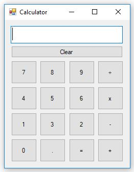

# My Calculator

My simple calculator app is a modern Windows app written in C#. The calculator has standard functionality which offers basic operations and evaluates commands immediately as they are entered.

# What I Learnt

- A switch statement would have been more efficient than a set of nested ifs.
- Developed an interface with Button and TextBox.
- Write simple math operations with C#.
